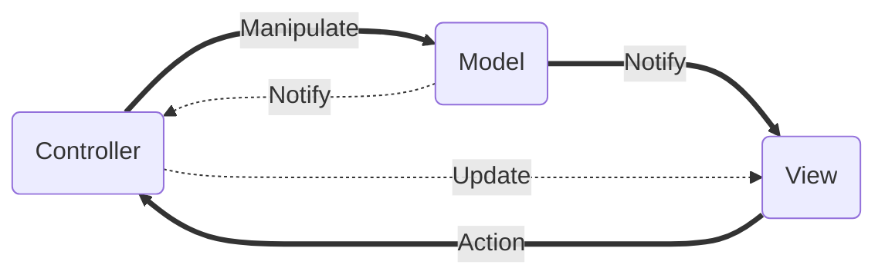
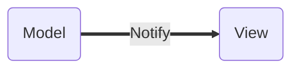
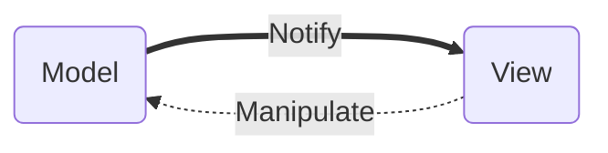
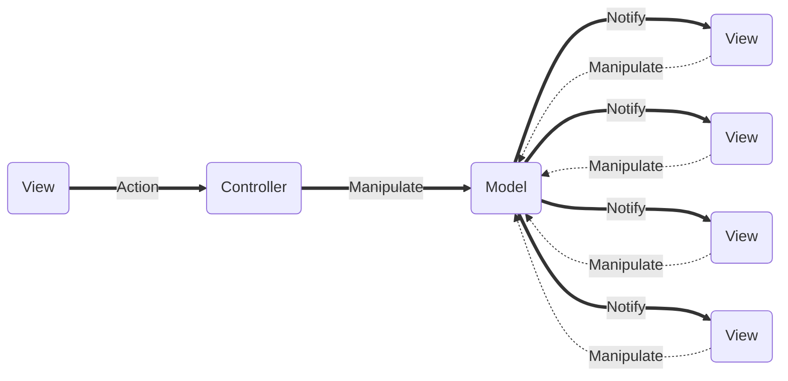
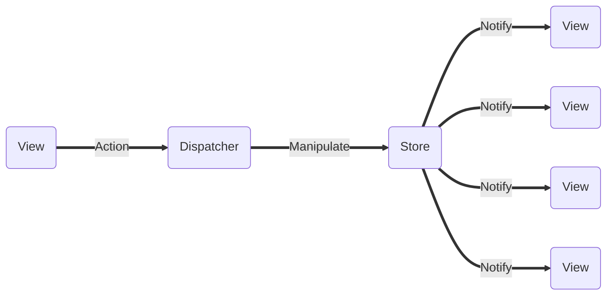

### **React란?**

[리액트 교과서 - React 살펴보기](https://velog.io/@kyusung/React-%EC%82%B4%ED%8E%B4%EB%B3%B4%EA%B8%B0)

[[React] React.js란? (간단 정리)](https://velog.io/@jini_eun/React-React.js%EB%9E%80-%EA%B0%84%EB%8B%A8-%EC%A0%95%EB%A6%AC)

React를 이해하고 분석하기 위해서는 다음과 같은 중요한 두가지 특징을 이해해야 합니다.

1. React는 SPA를 전제로 상태에 종속, 상태를 관리하는 View(컴포넌트)를 조합해 화면을 구성한다
2. React는 상태의 단방향 데이터 흐름을 강제함으로써 MVC 패턴의 안티 패턴을 예방한다

### **SPA(Single Page Application)**

[[앵귤러] SPA (Single Page Application)에 대한 고찰](https://paperblock.tistory.com/87)

SPA는 하나의 페이지로 구성된 애플리케이션(단일 페이지 애플리케이션)을 칭하는 용어입니다. 사실 SPA는 React가 아니라 Angular에서 처음 등장한 용어입니다. React는 Angular의 SPA와 컴포넌트라는 개념에 단방향 상태 관리라는 개념을 추가한 프레임워크입니다. 먼저 React가 차용한 Angular 프레임워크의 SPA 특징에 대해서 알아 보겠습니다.

SPA는 첫 페이지 요청 시 단 한번만 리소스를 요청하고 이후로는 페이지 리로딩 없이 필요한 부분만 교체하는 방식으로 웹 페이지를 구성하는 웹 개발 기법입니다. 따라서 네이티브 앱에 가까운 사용자 경험(UX)과 자연스러운 페이지 이동을 제공합니다. 주로 클라이언트 단에서 화면을 구성하기 때문에 Client Side Rendering(CSR)이라고도 불립니다.

SPA의 반대 급부에는 MPA가 있습니다. MPA는 Multiple Page Application의 줄임말로 서버에서 필요한 각각의 페이지를 여러번 받아오는 방식입니다. MPA는 주로 서버 쪽에서 렌더링 엔진을 통해 화면을 구성하고 이를 클라이언트로 전송하므로 Server Side Rendering(SSR)이라고도 불립니다.

MPA와 비교했을 때 SPA의 장점은 첫 로딩 이후에는 네이티브 앱과 같은 자연스러운 사용자 경험을 제공한다는 것입니다. 즉, 새로고침 없이 화면을 구성할 수 있습니다. 또한 페이지를 이동하더라도 필요한 부분만 교체하면 되므로 효율성이 증가합니다. 또한 모듈화, 컴포넌트 개발이 용이하기 때문에 컴포넌트의 재사용성이 증가하는데 앞서 말한 효율성 부분과 어느 정도 관련이 있는 부분입니다. 

그리고 클라이언트 단 로직이 서버단 로직을 위임받기 때문에 관심사의 분리를 명확하게 할 수 있으며 서버의 부담도 경감됩니다. SPA에서 서버는 필요한 데이터를 제공하는 역할에만 충실하게 됩니다. 보통 서버는 클라이언트에 JSON과 같은 통일된 데이터 형식을 제공하기 때문에 웹, 앱 확장에도 유리합니다

반면 SPA에도 단점은 존재합니다. SPA는 첫 로딩 시에 사이트 구성과 관련된 모든 리소스를 한번에 받기 때문에 초기 구동 속도가 느린 편입니다. 하지만 이는 특정 라우팅 때마다 리소스를 분산해서 로드하는 Lazy Loading 기법을 통해 극복이 가능합니다. 

또한 SPA의 경우 MPA처럼 완성된 템플릿을 전달받지 않고 클라이언트 단에서 동적으로 화면을 구성하기 때문에 특정 화면이 그려지고 데이터 수신이 완료되는 경우와 같은 비동기적 상황에서 약간은 부자연스러운 화면 전환이 일어날 가능성도 존재합니다. 이는 로딩 스피너와 같은 사전 렌더링 화면을 구성하는 Pre Rendering 기법을 통해 UX적인 측면에서 나름의 해결책을 고안해볼 수 있습니다. 

또한 SPA는 클라이언트 단에서 화면을 구성하기 때문에 중요한 비즈니스 로직이 노출될 우려도 있습니다. 이는 부분적 SSR 도입을 통해 어느 정도 해결이 가능한 부분입니다. 

무엇보다도 가장 치명적인 단점은 검색엔진 최적화가 어렵다는 것입니다. 이는, 검색 엔진이 크롤링을 할 때 JavaScript를 실행하지 않고 HTML 파일을 긁어가는 방식으로 이루어져 있기 때문입니다. 아직 이 부분에 대한 명확한 해결책은 없습니다만 Next JS와 같은 프레임워크의 도입을 통해 어느 정도 해결할 수 있는 여지도 분명히 존재합니다.

### **MVC 패턴**

[MVC - 용어 사전 | MDN](https://developer.mozilla.org/ko/docs/Glossary/MVC)

SPA와 컴포넌트 기반의 개발의 저편에는 MVC 패턴이 존재합니다. 결국에는 View를 생성하는 방법론으로 파악해볼 수 있겠습니다. 현대의 많은 웹 개발의 기반에는 MVC 아키텍처 패턴이 주로 사용됩니다. MVC 패턴은 다음과 같이 비즈니스 로직과 화면 로직을 구분하는데 중점을 두는 디자인 패턴입니다. 

MVC 패턴에서 Controller는 사용자의 입력(Action)에 대한 응답으로 Model을 Manipulate하는 로직이 포함을 포합합니다. Controller는 Model을 거치지 않고 View를 직접 Update 할 수도 있는데 위에서는 점선으로 표기했습니다. Model은 Controller로부터 지시를 받아 상태를 정의하고 상태 변경시 키는 로직이 포함됩니다. 그리고 그렇게 상태가 변경되면 View에 Notify하는 역할도 담당하고 있습니다. 때에 따라서 Model은 Controller에게 데이터의 상태 변경을 Notify할 수도 있는데 위에서는 점선으로 표기했습니다. View는 앱의 Model을 표현하는 로직을 정의합니다. 앞서 다루었던 SPA적인 특징이 사실은 바로 이 View를 구현하는 방법론입니다. View는 사용자의 입력(Action)을 Controller에게 전달하고 비로소 MVC 패턴의 각 요소가 연결되어 상호작용할 수 있습니다.

### **MVC 안티 패턴**

앞서 언급한 MVC 아키텍처 패턴의 (위 도식에서 보았듯이) Model과 View 사이에는 다음과 같이 오로지 Model이 View에게 상태 변경을 통보하는 단방향 데이터 흐름밖에 존재하지 않습니다. 

하지만 SPA를 전제로하는 컴포넌트 기반의 개발 방법에서는 기본적으로 컴포넌트가 Controller의 역할을 수행해야 하는 상황도 많이 존재하는 것 같습니다(확실치는 않습니다). 따라서 다음과 같이 Model과 View 사이의 양방향 데이터 흐름이 발생하는 안티 패턴이 발생할 여지가 충분히 존재합니다.

해당 안티 패턴은 View와 Controller의 구분이 명확하지 않기(관심사의 분리가 명확하지 않기) 때문에 앱의 규모가 커질수록, 새로운 기능을 추가할 때마다 시스템의 복잡도를 기하급수적으로 증가시키고 예측 불가능한 코드를 생산할 가능성을 키웁니다. 만약 여러개의 View가 존재한다면 다음과 같아집니다.

### **React - Flux**

[[디자인패턴] Flux, MVC 비교](https://beomy.tistory.com/44)

사실 MVC 패턴은 SPA를 전제로 하는 컴포넌트 기반의 개발 방법에서는 약간은 적용하기 어려웠던 부분이 있었던 것 같습니다. 이에 페이스북은 MVC 패턴을 변형한 다음과 같은 Flux 패턴을 소개합니다. 

Flux 패턴은 기존 MVC 패턴에서 모호한 위치에 있던 Controller의 역할을 View와 Dispatcher로 분리하여 관리하는 것 같습니다. 앞서 보았던 MVC 패턴에서 Controller의 역할은 Model의 데이터를 수정하는 역할과 이를 Model에 직접 반영하는 역할(Manipulate)로 구분해 볼 수 있습니다. Model의 데이터를 수정하는 역할은 View가 담당하되 Model을 직접 Manipulate하는 역할은 Dispatcher가 담당합니다. 이렇게 Controller의 역할을 분담함으로써 앞서 언급했던 Model과 View 사이의 양방향 데이터 흐름이라는 안티 패턴을 예방할 수 있게된 것 같습니다. 기존 안티 패턴의 문제점은 컨트롤러가 따로 있음에도 불구하고 View가 컨트롤러의 역할을 맞게 되면서 아키텍처가 엉망이 된 것 때문에 문제가 발생했는데 컨트롤러를 없애고 그 역할을 View와 Dispatcher가 나눠갖게 되면서 Model과 View 사이의 단방향 데이터 흐름을 강제하게 된것입니다.

Dispatcher는 View로부터 전달된 Action, 즉 Model(여기서는 Store)의 변경된 상태를 전달 받고 등록된 콜백함수를 실행하여 Store의 데이터를 Manipulate합니다. Store는 Dispatcher로부터 전달받은 데이터를 싱글톤 패턴으로 상태에 적용하고 이를 View에게 알립니다. View는 전달받은 상태를 화면에 보여주고 다시 Action을 생성해 위 과정을 반복합니다. 

페이스북은 이러한 Flux 패턴을 통해 두가지의 목적을 달성했습니다. 첫번째는 모호한 Controller의 역할을 View와 Dispatcher로 분리함으로써 MVC 패턴을 SPA 구조에 맞게 변형했다는 것입니다. 때문에 React의 컴포넌트(View)는 상태를 관리하는 역할을 맞게 됩니다. 두번째는 컴포넌트의 상태 관리가 직접적으로 Store에 반영되기 위해서는 반드시 Dispatcher를 거쳐야 하고 Store를 통해 컴포넌트가 변경되기 때문에 단방향 데이터 흐름이 강제된다는 것입니다. 따라서 React의 컴포넌트(View)는 상태에 종속됩니다. 즉, 결과적으로 Flux 패턴에서 View는 상태를 수정하는 Controller의 역할과 상태에 종속되어 화면에 출력되는 View의 역할을 동시에 맞습니다. 그리고 Dispatcher는 변경된 상태를 반영하는 Controller의 역할을 분담해 가집니다. Store는 기존의 Model과 거의 유사한 역할을 맞습니다.