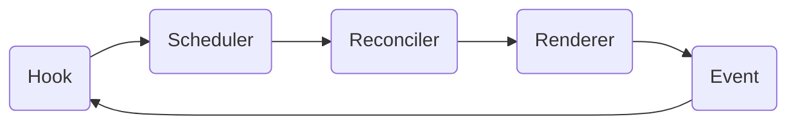

### 출처

[React 톺아보기 - 01. Preview | Deep Dive Magic Code](https://goidle.github.io/react/in-depth-react-preview/)

[React 톺아보기 - 02. Intro | Deep Dive Magic Code](https://goidle.github.io/react/in-depth-react-intro/)

[](https://namu.wiki/w/%EB%8D%94%EB%B8%94%20%EB%B2%84%ED%8D%BC%EB%A7%81)

[컴퓨터 그래픽스 이론 정리 - 더블버퍼링(Double Buffering)](https://huiyu.tistory.com/entry/%EC%BB%B4%ED%93%A8%ED%84%B0-%EA%B7%B8%EB%9E%98%ED%94%BD%EC%8A%A4-%EC%9D%B4%EB%A1%A0-%EC%A0%95%EB%A6%AC-%EB%8D%94%EB%B8%94%EB%B2%84%ED%8D%BC%EB%A7%81Double-Buffering)

[비트마스크 (BitMask) 알고리즘](https://rebro.kr/63)

### 들어가기

React의 상태 관리라는 특징은 Flux 패턴을 통해, SPA를 전제로 하는 컴포넌트 기반의 개발 방식이라는 특징은 Rendering & Committing 패턴을 통해 설명될 수 있었습니다. 이번에는 리액트의 어떤 패키지가 이러한 특징들을 구체화하였는지, 그리고 해당 패키지들의 특징을 간략하게 설명하겠습니다.

### React의 주요 패키지

React를 구성하는 주요 패키지들은 다음과 같습니다.

**React**: 컴포넌트 정의와 관련된 패키지로 React Element를 만드는 createElement 메서드가 포함되어 있습니다. 다른 패키지와의 의존 관계는 없습니다.

**Scheduler**: React의 작업(Task)의 우선 순위에 따라 스케줄링하는 패키지 이며 주로 비동기 실행과 관련된 스케줄을 처리합니다. 해당 패키지는 호스트 환경에 의존적입니다.

**Reconciler**: React의 핵심 패키지이며 React Element를 토대로 Virtual DOM Tree를 생성합니다.

**Renderer**: react-dom, react-native-renderer와 같은 호스트 환경 렌더링과 관련된 패키지로 구성되어 있습니다. 해당 패키지는 호스트 환경과 Reconciler, Event에 의존적입니다.

**Event**: SyntheticEvent라는 명칭으로 개발자가 event를 사용하기 전 추가적인 제어를 하기 위해 호스트 환경에서 제공하는 event 객체를 Wrapping 합니다. 해당 패키지는 호스트 환경에 의존적입니다.

### React 패키지의 일반적인 흐름

React 패지지의 흐름은 다음과 같은 패키지의 흐름으로 구체화해서 표현할 수 있습니다. 



여기서 Event 에서 Hook으로 도달하는 과정은 Flux 패턴과 대응해서, Hook에서 Scheduler, 다시 Reconciler에서 Renderer에 도달하는 과정은 Render & Commit 패턴에 매칭해서 보면 편합니다.

1. Hook을 통해 컴포넌트 상태를 업데이트한다.
2. 업데이트를 반영할 Work를 Scheduler에게 전달하고 스케줄링된 Task를 적절한 시기에 실행한다
3. Work를 통해 VDOM 재조정 작업을 진행한다.
4. Work를 진행하며 발생한 변경점을 적용한다.
5. 사용자의 상호작용으로 이벤트가 발생하고 등록된 핸들러가 실행되면서 Hook이 실행된다.

### Trigger Phase(Event → Hook)

→  보류

### Render Phase(Hook → Scheculer → Reconciler)

리액트는 Hook을 통한 Triggering이 생겼을 때, 이를 VDOM에 반영하기 위해 작업(Work)을 담당하는 함수를 Scheduler를 통해 실행함으로써 Render Phase에 돌입하게 됩니다. 이때 Work는 Render Phase와 Commit Phase 전반에 걸쳐 행해지는 작업을 의미합니다.

Render Phase에 들어가게 되면 먼저 컴포넌트를 호출합니다. 컴포넌트는 React Element를 반환하게 되는데 이는 컴포넌트 호출 시 반환되는, 컴포넌트의 정보를 담고 잇는 객체입니다. React 컴포넌트가 일반적으로 반환하는 JSX는 Babel을 통해 react.createElement로 변환되어 ReactElement를 반환합니다 JSX를 통해 반환된 Attribute의 값 중 key, ref를 제외한 모든 값은 props로 관리합니다.

```jsx
const App = ({ content }) => <div>{content}</div>
ReactDOM.render(<App key="1" content="Deep dive react" />, container)

const element = {
  // This tag allows us to uniquely identify this as a React Element
  $$typeof: REACT_ELEMENT_TYPE,

  // Built-in properties that belong on the element
  type: type, // function App()
  key: key, // 1
  props: props, // { content: 'deep dive react' }
  ref: ref, // undefined
}
```

Render Phase는 컴포넌트가 반환하는 React Element를 VDOM을 재조정하는 일련의 과정입니다. React Element는 그 자체로 VDOM이 아닙니다. 리액트의 Render Phase는 Fiber 과정을 통해 React Element를 확장시켜 fiber 객체로 확장시키는 과정을 포함합니다. fiber 객체야 말로 진정한 의미의 Virtual DOM이자 리액트의 컴포넌트가 살아 숨쉬기 위한 모든 정보를 갖는 객체입니다.

```jsx
function FiberNode(tag, pendingProps, key){
  // Instance
  this.tag = tag; // fiber의 종류를 나타냄
  this.key = key;
  this.type = null; // 추후에 React element의 type을 저장
  this.stateNode = null; // 호스트 컴포넌트에 대응되는 HTML element를 저장

  // Fiber
  this.return = null; // 부모 fiber
  this.child = null; // 자식 fiber
  this.sibling = null; // 형제 fiber
  this.index = 0; // 형제들 사이에서의 자신의 위치

  this.pendingProps = pendingProps; // workInProgress는 아직 작업이 끝난 상태가 아니므로 props를 pending으로 관리
  this.memoizedProps = null; // Render phase가 끝나면 pendingProps는 memoizedProps로 관리
  this.updateQueue = null; // 컴포넌트 종류에 따라 element의 변경점 또는 라이프사이클을 저장
  this.memoizedState = null; // 함수형 컴포넌트는 훅을 통해 상태를 관리하므로 hook 리스트가 저장된다.

  // Effects
  this.effectTag = NoEffect; // fiber가 가지고 있는 side effect를 기록
  this.nextEffect = null; // side effect list 
  this.firstEffect = null; // side effect list
  this.lastEffect = null; // side effect list 

  this.expirationTime = NoWork; // 컴포넌트 업데이트 발생 시간을 기록
  this.childExpirationTime = NoWork; // 서브 트리에서 업데이트가 발생할 경우 기록

  this.alternate = null; // 반대편 fiber를 참조
}
```

React의 Virtual DOM(fiber)은 더블 버퍼링 형태로 운영됩니다. 더블 버퍼링이란 주로 컴퓨터 그래픽에서 사용되는 용어로, 단일 프론트 버퍼만을 활용하는 싱글 버퍼링의 화면 깜빡임 문제를 해결하기 위해 사용되는 기법입니다. 싱글 버퍼링은 다음과 같이 비디오 메모리(프론트 버퍼)만 사용하기 때문에 데이터를 처리하는 동안의 시간 동안 데이터 전송이 지연되어 화면 깜빡임이 발생합니다.


반면 더블 버퍼링의 경우 다음과 같이 프론트 버퍼와 예비 버퍼(백 버퍼)를 동시에 두어 데이터 처리, 데이터 표현을 분리하여 처리하고 처리가 완료된 백버퍼를 프론트 버퍼로 스위칭하기 때문에 싱글 버퍼링의 화면 깜빡임 문제를 해결할 수 있습니다.


React의 Virtual DOM의 경우 프론트버퍼에서 관리되는 VDOM을 Current Tree라고 칭하며 DOM에 마운트가 완료된 VDOM 트리를 의미합니다. 백버퍼에서 관리되는 VDOM은 WorkInProgress Tree라고 칭하며 Render Phase과정을 거쳐 DOM에 마운트된 후, Current Tree로 스위칭됩니다.

또한 React는 VDOM을 변경하는 작업을 Side Effect라고 칭합니다. 리액트는 이를 Side Effect Tag로 관리하는데 해당 태그는 fiber 객체의 effect Tag에 저장되며 Commit Phase에서 소비됩니다.

```jsx
export const NoEffect = /                / 0b0000000000000;
export const PerformedWork = /           / 0b0000000000001;
export const Placement = /               / 0b0000000000010;
export const Update = /                  / 0b0000000000100;
export const PlacementAndUpdate = /      / 0b0000000000110;
export const Deletion = /                / 0b0000000001000;
export const ContentReset = /            / 0b0000000010000;
export const Passive = /                 / 0b0001000000000;
```

참고로 리액트는 effect tag나 여러 상태 값을 Bit Masking으로 관리합니다. Bit Masking이란 이진수를 사용하는 컴퓨터의 연산 방식을 이용하여 정수의 이진수 표현을 자료구조로 쓰는 기법입니다. 하나의 비트는 0과 1로 on/off(참/거짓)의 상태를 표현할 수 있는데 이를 조합하면 여러가지 경우의 수를 표현할 수 있기에 해당 기법은 여러가지 경우의 수를 나타내거나 집합 구조를 표현할 때 주로 쓰입니다 

Bit Masking은 bit 연산을 수행하기 때문에 O(1)의 시간복잡도로 구현되는 것이 많으며 이는 다른 자료구조보다 빠른 수행시간을 가집니다. 또한 bit로 표현된 하나의 정수가 많은 경우의 수를 가질 수 있기 때문에 다른 자료구조에 비해 메모리 점유율 측면에서도 효율적입니다. 

추가로 이러한 재조정 과정을 React 16 이전에는 동기적으로 실행되는 스택 기반의 Reconciler가 수행했습니다. React 16 이후로 넘어오면서 Reconciler는 Filber 아키텍쳐로 변경되었습니다. Fiber는 기존의 스택 기반의 아키텍쳐를 버리고 비동기적 실행을 지원하는 새로운 Reconciler 아키텍처라고 봐도 무방합니다. 

### Commit Phase(Renderer → Event)

Commit Phase는 Render Phase에서 재조정된 VDOM을 DOM에 마운트하는 작업을 포함합니다. 이때, Commit Phase는 일관적인 화면 업데이트를 위해 동기적으로 실행됩니다. 즉, 콜 스택을 한번도 비우지 않고 DOM 조작을 일괄처리한다는 뜻입니다. 또한 Commit Phase에서는 Element에 등록된 Event를 처리하는 작업 역시 포함됩니다.