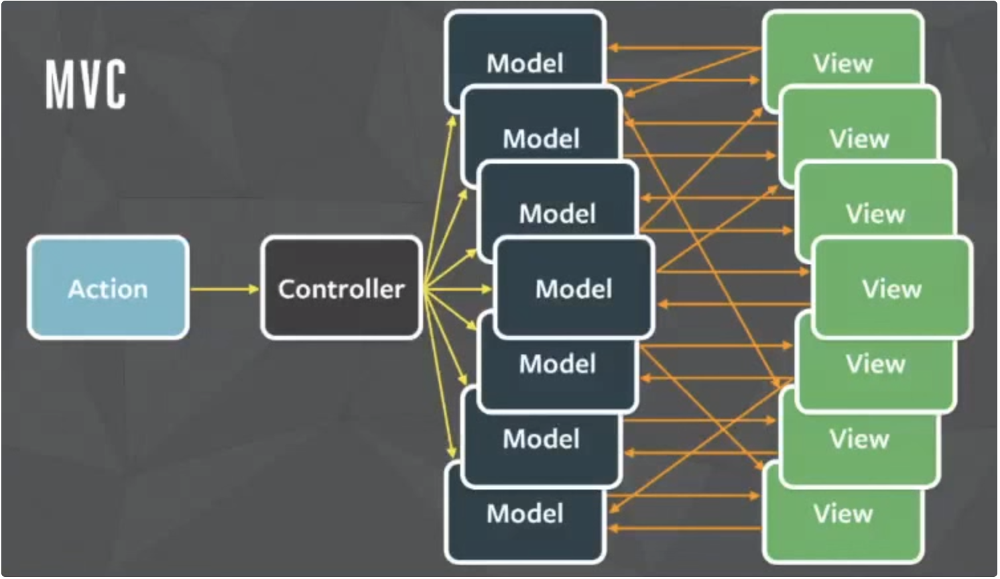
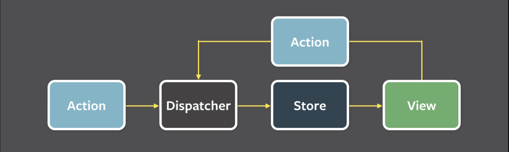

# 출처
* [버미노트 MVC](https://beomy.tistory.com/43)
* [위키피디아 MVC](https://ko.wikipedia.org/wiki/%EB%AA%A8%EB%8D%B8-%EB%B7%B0-%EC%BB%A8%ED%8A%B8%EB%A1%A4%EB%9F%AC)
* [버미노트 Flux](https://beomy.tistory.com/44)
* [해리 Flux](https://velog.io/@andy0011/Flux-%ED%8C%A8%ED%84%B4%EC%9D%B4%EB%9E%80)

# MVC 패턴
* 소프트웨어의 비즈니스 로직과 화면을 구분하는데 중점을 둔 소프트웨어 디자인 패턴

* 구성요소
  * Model: 데이터와 비즈니스 로직을 관리
  * View: 레이아웃과 화면을 처리
  * Controller: 사용자의 입력(Action)을 받고 처리하여 Model과 View를 조작
* 동작
  1. Action이 Controller에 들어옴
  2. Controller는 Action을 처리해 Model의 상태를 변경
  3. Controller는 Model을 나타내줄 View의 레이아웃을 선택
  4. View는 Model의 상태를 반영하여 화면에 표현함
     * View가 Model의 상태를 직접 읽어와 업데이트하는 방법
     * Model이 View에게 상태 변화를 Notify하여 업데이트 하는 방법
     * View가 Model의 상태를 주기적으로 검사(Polling)하여 업데이트하는 방법
  5. View는 Action을 생성함
* 장점
  * 패턴이 단순하여 적용이 쉬움
* 단점

  * (전통적인 MVC 모델에서는 View가 Model을 업데이트하는 등의 양방향 데이터 흐름이 발생하면 안되지만 일련의 이유로 이를 변형해야 하는 경우가 있는 것 같다)
  * View와 Model 사이의 양방향 데이터 흐름은 시스템의 복잡도를 증가시키고 예측 불가능한 코드를 만들어 프로그램의 안정성을 떨어뜨릴 위험성이 있음
  
# Flux 패턴
* MVC 패턴의 양방향 데이터 흐름이 가져오는 복잡성을 해결하기 위해 페이스북이 제안한 단방향 데이터 흐름 패턴

* Action
  * 새로운 상태가 담겨져 있는 객체
  * Type(데이터 타입)과 Payload(새로운 데이터)를 Dispatcher에게 전달
  * 대체로 Action creator에서 생성됨
* Dispatcher
  * 전달된 Action을 받고 콜백 함수(Reducer)를 통해 Store에 데이터를 전달
  * 전체 어플리케이션에서 오직 하나의 인스턴스만 사용됨
* Store
  * Observer를 관리하는 Subject
  * dispatcher로부터 데이터를 전달 받아 상태를 관리하는 Subject
  * Notify 함수를 호출하여 상태 변화를 View에 통보
  * 싱글톤 패턴으로 관리됨
* View
  * Store를 관찰하는 Observer
  * Store의 상태 변화 시 수행할 동작을 정의
  * 자식 View로 데이터를 흘려보내는 뷰 컨트롤러의 역할도 함께함

# Redux
